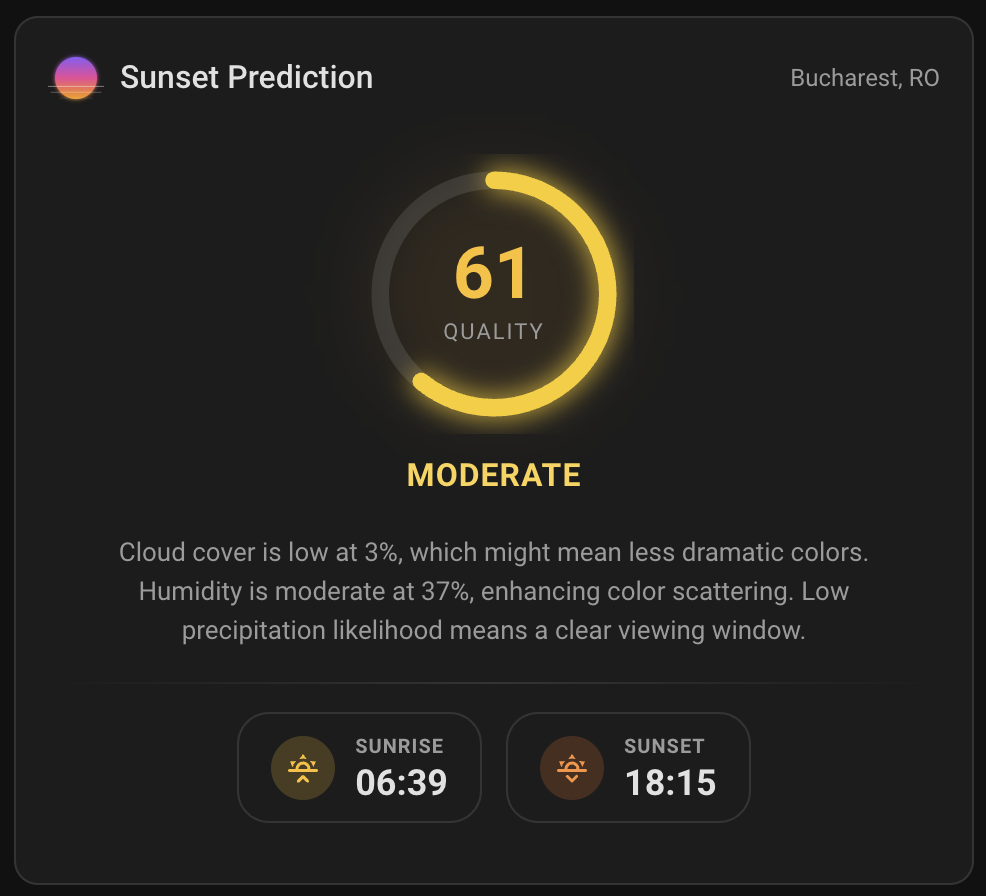
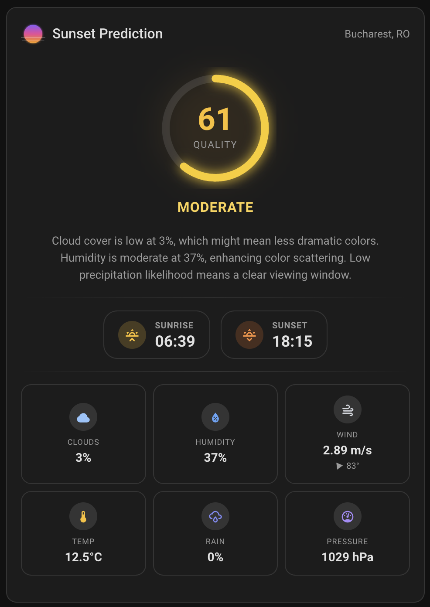

# HA Sunset Predictor

A Home Assistant integration that predicts sunset quality using [sunset-predictor.com](https://sunset-predictor.com).

| Minimal | With weather details |
|:---:|:---:|
|  |  |

*Screenshots from the companion [sunset-predictor-card](https://github.com/sunset-predictor/sunset-predictor-card)*

## Features

- Sunset quality score (0–100) based on weather conditions
- Detailed weather factors (cloud cover, humidity, visibility, wind, rain)
- Sunset and sunrise times
- Localized explanations (en, fr, de, es, ro, ru, uk)
- Configurable polling interval

## Installation

### HACS (Recommended)

1. Open HACS in Home Assistant
2. Click the three dots menu → **Custom repositories**
3. Add this repository URL and select **Integration** as the category
4. Search for "Sunset Predictor" and install
5. Restart Home Assistant

### Manual

1. Copy the `custom_components/sunset_predictor` folder to your Home Assistant `config/custom_components/` directory
2. Restart Home Assistant

## Configuration

1. Go to **Settings → Devices & Services → Add Integration**
2. Search for "Sunset Predictor"
3. Enter your API key from [sunset-predictor.com](https://sunset-predictor.com)
4. Configure your location and language

## Sensor

The integration creates a sensor entity `sensor.sunset_predictor` with:

- **State**: Sunset quality score (0–100)
- **Attributes**: label, explanation, confidence, sunset/sunrise times, weather factors, raw meteorological data

## Companion Card

For a beautiful dashboard display, use the companion Lovelace card: [sunset-predictor-card](https://github.com/sunset-predictor/sunset-predictor-card)
