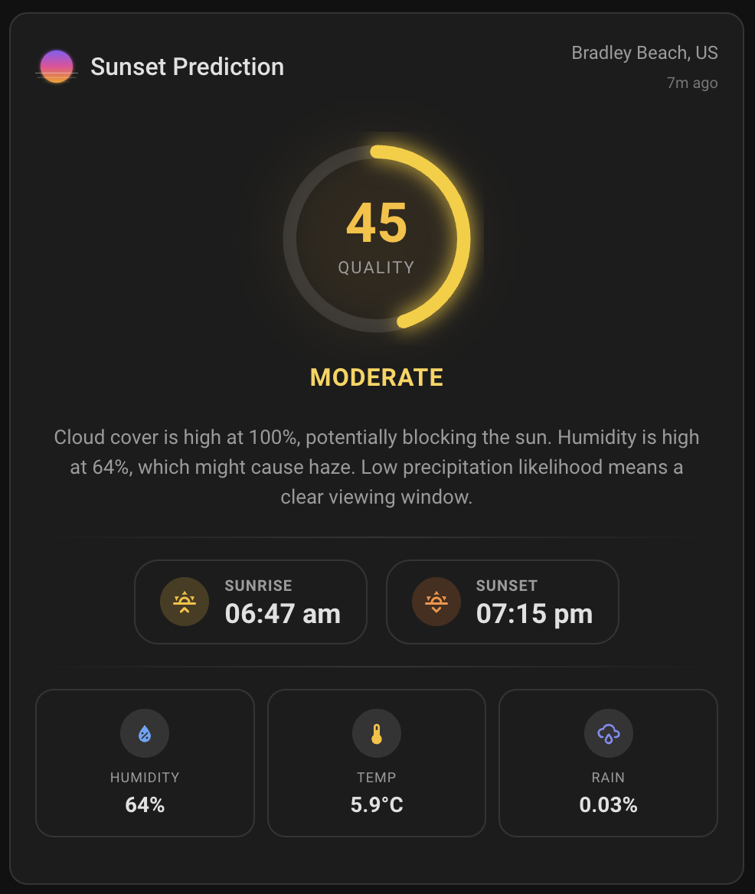
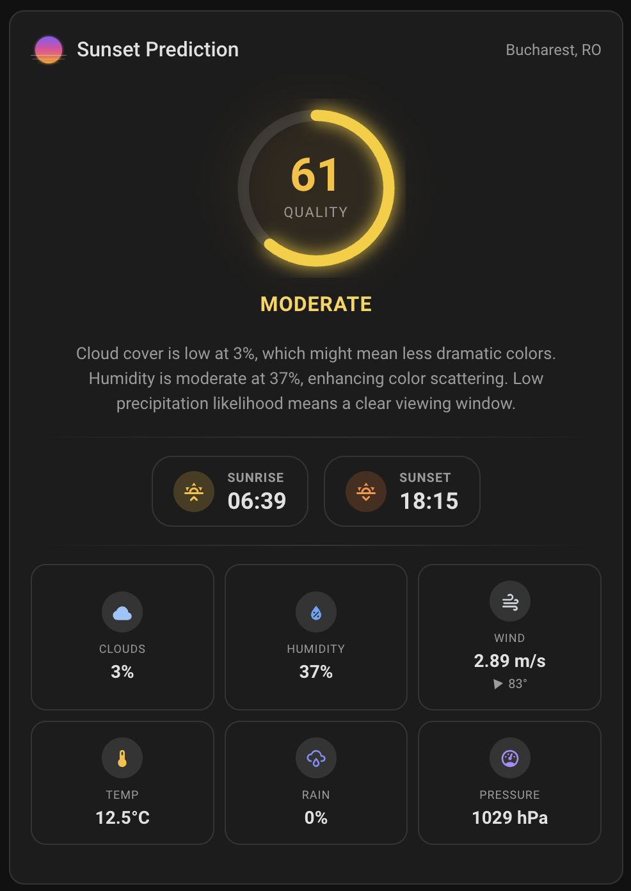

# HA Sunset Predictor

[](https://github.com/hacs/integration)

A Home Assistant integration that predicts sunset quality using [sunset-predictor.com](https://sunset-predictor.com).

| Minimal | With weather details |
|:---:|:---:|
|  |  |

*Screenshots from the companion [sunset-predictor-card](https://github.com/mishasyrbu/sunset-predictor-card)*

## Features

- Sunset quality score (0–100) based on weather conditions
- Detailed weather factors (cloud cover, humidity, visibility, wind, rain)
- Sunset and sunrise times
- Localized explanations (en, ru, fr, ro, uk, de, es, it, ar, ja, he, zh-CN, pt, hi)
- Configurable polling interval
- Automatic nighttime skip — no API calls after sunset until the next sunrise

## Installation

### HACS (Recommended)

1. Open HACS in Home Assistant
2. Click the three dots menu → **Custom repositories**
3. Add this repository URL and select **Integration** as the category
4. Search for "Sunset Predictor" and install
5. Restart Home Assistant

### Manual

1. Copy the `custom_components/sunset_predictor` folder to your Home Assistant `config/custom_components/` directory
2. Restart Home Assistant

## Configuration

1. Go to **Settings → Devices & Services → Add Integration**
2. Search for "Sunset Predictor"
3. Enter your API key from [sunset-predictor.com](https://sunset-predictor.com)
4. Configure your location and language

## Sensor

The integration creates a sensor entity `sensor.sunset_predictor` with:

- **State**: Sunset quality score (0–100)
- **Attributes**: label, explanation, confidence, sunset/sunrise times, weather factors, raw meteorological data

## Development

### Prerequisites

- Python 3.12+
- A running Home Assistant instance (or [dev container](https://developers.home-assistant.io/docs/development_environment))

### Setup

```bash
git clone https://github.com/mishasyrbu/ha-sunset-predictor.git
cd ha-sunset-predictor
python -m venv venv
source venv/bin/activate
pip install homeassistant
```

### Project structure

```
custom_components/sunset_predictor/
├── __init__.py       # Integration setup and teardown
├── api.py            # API client for sunset-predictor.com
├── config_flow.py    # Config and options flow UI
├── const.py          # Constants (domain, defaults, endpoints)
├── coordinator.py    # DataUpdateCoordinator with nighttime skip
├── sensor.py         # Sensor entity exposing score and attributes
├── manifest.json
├── strings.json
└── translations/     # Localized strings (en, ru, fr, ro, uk, de, es, it, ar, ja, he, zh-Hans, pt, hi)
```

### Testing

#### CI validation

The repository runs two validation checks on every push and PR:

- **HACS validation** — ensures the integration meets [HACS](https://hacs.xyz/) requirements
- **hassfest** — validates `manifest.json` and integration structure against Home Assistant standards

#### Manual testing

1. Copy `custom_components/sunset_predictor` into your HA `config/custom_components/` directory:
   ```bash
   scp -r custom_components/sunset_predictor user@your-ha-server:/path/to/homeassistant/config/custom_components/sunset_predictor
   ```
2. Restart Home Assistant
3. Add the integration via **Settings → Devices & Services → Add Integration**
4. Verify the sensor entity appears and reports a score
5. Test the options flow by changing language, polling interval, or coordinates

#### Key scenarios to verify

- **Setup flow**: valid API key creates the entry; invalid key shows an error
- **Duplicate prevention**: adding the same coordinates twice is rejected
- **Options flow**: changing settings reloads the integration with updated values
- **Nighttime skip**: after sunset, the coordinator returns cached data instead of calling the API
- **Auth failure**: an expired/revoked API key triggers HA's reauthentication flow
- **Network errors**: temporary API outages show as "unavailable" without crashing the integration

## Companion Card

For a beautiful dashboard display, use the companion Lovelace card: [sunset-predictor-card](https://github.com/mishasyrbu/sunset-predictor-card)
